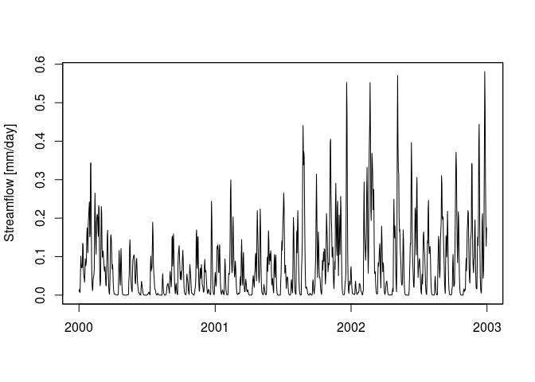

<!-- Edit the README.Rmd only!!! The README.md is generated automatically from README.Rmd. -->
fuse: an R package implementing the Framework for Understanding Structural Errors
---------------------------------------------------------------------------------

[](https://zenodo.org/badge/latestdoi/67341718) [](http://joss.theoj.org/papers/392a55daada04a86f95eaa8da134a28d)

[](https://travis-ci.org/cvitolo/fuse.svg?branch=master) [](https://ci.appveyor.com/project/cvitolo/fuse) [](https://codecov.io/github/cvitolo/fuse?branch=master)

The Framework for Understanding Structural Errors (FUSE) was developed by Clark et al. (2008) and is a state-of-the-art modelling toolbox. It includes 1248 hydrological model structures, amongst which some well established models for rainfall-runoff simulations (i.e. PRMS, SACRAMENTO, TOPMODEL and ARNO/VIC, also defined as parent models). Each model is characterised by a different architecture of the upper and lower soil layers and parameterisation of processes such as: evaporation, vertical percolation, interflow, base flow and surface runoff.

Fuse takes as input rainfall and potential evapotranspiration time series (areal averages over the river catchment area) and returns a simulated time series of river discharges. It can be used to understand the variability of expected hydrological responses based on model structures.

This package is a re-implementation of the framework described in Clark et al. (2008) and based on the Fortran code provided by M. Clark in 2011. The package consists of two modules: Soil Moisture Accounting module (fusesma.sim) and Gamma routing module (fuserouting.sim). It also contains default parameter ranges (fusesma.ranges and fuserouting.ranges) and three data objects: fuse\_hydrological\_timeseries (sample input dataset), parameters (sample parameters) and modlist (list of FUSE model structures).

### Dependencies

The fuse package, as well as the examples in the vignette, depend on a number of CRAN packages. Check for missing dependencies and install them:

``` r
packs <- c("dplyr", "zoo", "tgp", "stats", "utils", "BH", "Rcpp", "testthat",
           "qualV", "devtools")
new.packages <- packs[!(packs %in% installed.packages()[, "Package"])]
if(length(new.packages)) install.packages(new.packages)
```

### Installation

You can install this package from Github with [devtools](https://github.com/hadley/devtools):

``` r
devtools::install_github("cvitolo/fuse")
```

Load the package:

``` r
library("fuse")
```

### Usage

The simplest way to test `fuse` is to use the dummy data provided with this package, sample the parameter range using the built-in function `generateParameters()` and run the model with 1 model structure (e.g. TOPMODEL):

``` r
# Load the dummy data
data(fuse_hydrological_timeseries)

# Sample the parameter range
parameters <- generateParameters(1)

# Run fuse 
streamflow <- fuse(DATA = fuse_hydrological_timeseries, 
                   mid = 60,       # Model structure = TOPMODEL
                   deltim = 1,     # Daily time step
                   ParameterSet = parameters)

plot(streamflow, xlab = "", ylab = "Streamflow [mm/day]")
```



For details and more complex examples (e.g. multi-model ensemble), please refer to the [vignette](https://cvitolo.github.io/fuse/articles/fuse_vignette.html).

Fortran users are advised to refer to the latest version of fuse available [here](https://github.com/naddor/fuse).

### Meta

-   Code contributions are welcome! Please note that this project is released with a [Contributor Code of Conduct](CONDUCT.md). By participating in this project you agree to abide by its terms.
-   Please [report any issues or bugs](https://github.com/cvitolo/fuse/issues).
-   License: [GPL-3](https://opensource.org/licenses/GPL-3.0)
-   Get citation information for the `fuse` package in R doing `citation(package = 'fuse')`
